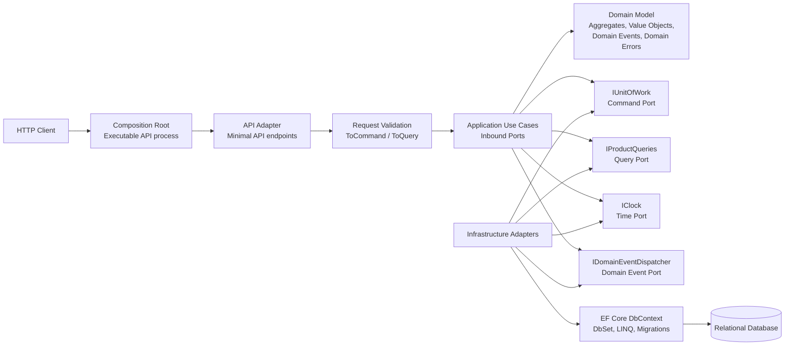

# ARCHITECTURE

> Layering rules, dependency direction, and Ports-and-Adapters style boundaries for the generated solution.

## Project responsibilities

| Project | Responsibility |
| --- | --- |
| `Company.Template.Domain` | Business model, invariants, value objects, domain events, domain errors |
| `Company.Template.Application` | Use cases, application ports, result handling, command/query contracts |
| `Company.Template.Infrastructure` | EF Core DbContext, persistence adapters, provider-specific setup |
| `Company.Template.Api` | HTTP adapter, endpoint modules, request validation, authentication, OpenAPI |
| `Company.Template.CompositionRoot` | Executable entry point and composition root for the HTTP API process |
| `Company.Template.Composition.Abstractions` | Pure service-composition feature contracts and markers |
| `Company.Template.Composition.AspNetCore` | ASP.NET Core pipeline feature-composition contracts |
| `Company.Template.MigrationService` | One-shot EF Core migration runner |
| `Company.Template.ServiceDefaults` | Shared hosting, telemetry, and resilience defaults |
| `Company.Template.AppHost` | Local orchestration with .NET Aspire |

## Dependency rules

- `Domain` references no other project.
- `Application` references `Domain` and defines application-level ports.
- `Infrastructure` references `Application` and `Domain` and implements outbound ports.
- `Api` references `Application` and acts as the HTTP adapter.
- `Api` references the ASP.NET Core composition contracts for WebApplication feature modules.
- `Composition` references `Api`, `Application`, `Infrastructure`, and `ServiceDefaults` and owns startup composition.
- `Application` and `Infrastructure` may reference pure service-composition abstractions but must not reference ASP.NET Core composition contracts.
- `MigrationService` references `Infrastructure` and `ServiceDefaults`.
- `AppHost` is used for local orchestration with .NET Aspire.
- Tests reference only the projects they need.

## Domain boundary

The Domain layer must not reference:

- EF Core
- ASP.NET Core
- Keycloak
- Aspire
- OpenTelemetry
- Serilog
- any other infrastructure concern

The Domain layer may expose domain concepts such as:

- aggregates
- value objects
- strongly typed IDs
- domain events
- domain errors
- domain results

## Ports and adapters style boundaries

The template follows Clean Architecture with Ports-and-Adapters style boundaries.

`Company.Template.Composition` is the executable composition root. It wires the API adapter, application layer, infrastructure adapters, and shared service defaults together.

The Domain layer contains business rules and has no dependency on technical infrastructure.

The Application layer defines the ports it needs:

- use cases as inbound application ports
- command persistence ports
- query ports
- clock and domain-event dispatching ports

Infrastructure and API provide adapters for those ports.



The ports are intentionally pragmatic. Application use cases do not depend on `DbContext`, `DbSet<T>`, or `IQueryable<T>`.

Infrastructure is free to use EF Core effectively behind those ports, including tracking, LINQ, projections, migrations, and provider-specific mapping.

## API boundary

The API layer is the HTTP adapter.

It owns:

- route definitions
- request and response contracts
- HTTP/request validation
- request-to-command/query mapping
- result-to-HTTP mapping
- authentication and authorization metadata
- OpenAPI metadata

API request validation uses a small dependency-free validation builder. It collects all independent field errors and converts them into a failed `Result<T>` before the use case is executed.

Application commands and queries remain independent from API request DTOs.

## Application boundary

The Application layer defines use cases and the ports required to execute them.

Command use cases access aggregates through a small command persistence boundary:

```text
IUnitOfWork
  -> IRepository<TAggregate, TKey>
```

Query use cases access read models through named query ports, for example:

```text
IProductQueries
```

This creates a deliberate command/query split:

| Side | Application dependency | Infrastructure implementation |
| --- | --- | --- |
| Commands | `IUnitOfWork`, `IRepository<TAggregate, TKey>` | `ApplicationDbContext`, EF Core tracking |
| Queries | named query interfaces such as `IProductQueries` | EF Core LINQ, projections, `AsNoTracking()` |

The abstraction is intentionally thin and Infrastructure-backed. It protects use cases from EF Core APIs without pretending that the generated application can switch persistence technology without design work.

The template does not introduce:

- a generic CRUD repository framework
- a specification framework
- a separate read-only DbContext abstraction
- persistence abstractions pretending that EF Core could be swapped out without design work

The goal is clarity and dependency direction, not abstraction for its own sake.

## Migration service

The MigrationService is an executable one-shot process.

It applies EF Core migrations and exits. It is used by Aspire so the database schema is updated before the composition entry point starts.

The local startup order is:

```text
database
  -> migration service
  -> composition API process
```

---

## Related documents

- [README](README.md)
- [ARCHITECTURE](ARCHITECTURE.md)
- [APPLICATION](APPLICATION.md)
- [API](API.md)
- [RESULTS](RESULTS.md)
- [PERSISTENCE](PERSISTENCE.md)
- [OBSERVABILITY](OBSERVABILITY.md)
- [DATABASE](DATABASE.md)
- [ASPIRE](ASPIRE.md)
- [AUTHENTICATION](AUTHENTICATION.md)
- [OPENAPI](OPENAPI.md)
- [MIGRATIONS](MIGRATIONS.md)
- [TESTING](TESTING.md)
- [FEATURES](FEATURES.md)
